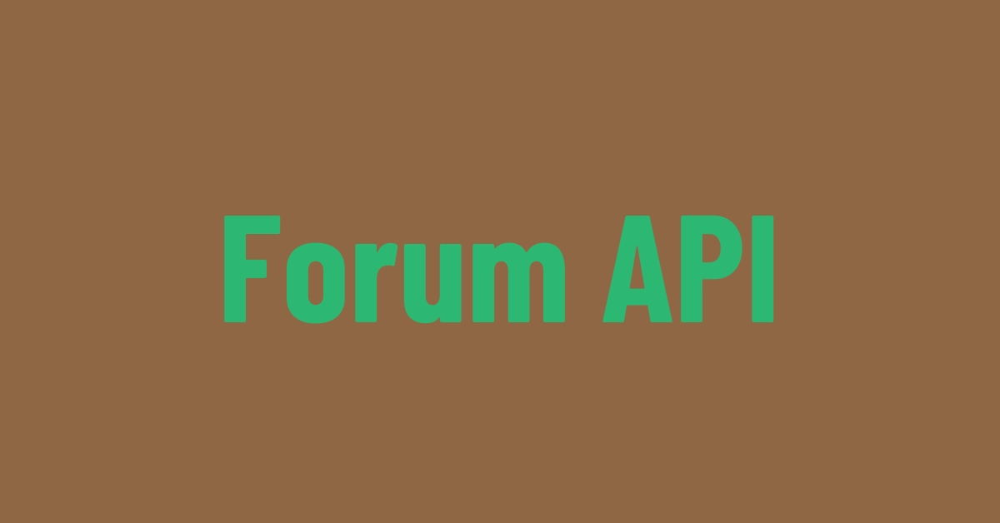

# Forum API




> This project is centered around an interactive Doubt Forum API. It provides a platform where users can post their queries, engage in intellectual discussions, and provide solutions to others’ questions. The unique feature of this API is its ability to support attachments, enhancing the clarity and comprehensibility of both questions and answers. This makes it a comprehensive tool for fostering collaborative learning and problem-solving.

## 💻 Prerequisites

Before you begin, make sure you've met the following requirements:

- Node Version - `18.17`
- OS - `Windows | Linux | Mac`
- Tools - `Docker`

## 🚀 Installing forum api

To install the forum api, follow these steps:

1 - Create .env and .env.test files.
2 - Create a account in AWS S3 and provide your keys in .env.example file.

``` powershell
  npm i
  docker compose up
```

## ☕ Using forum api

To use forum api, follow these steps:

``` powershell
  npm run start:dev
```

You can use the client.http file to make requests locally for testing. 🌐

## 🤝 Collaborators

<table>
  <tr>
    <td align="center">
      <a href="https://github.com/oswaldo-oliveira" title="Oswaldo Oliveira (github)">
        <br>
        <sub>
          <b>Oswaldo Oliveira</b>
        </sub>
      </a>
    </td>
  </tr>
</table>
